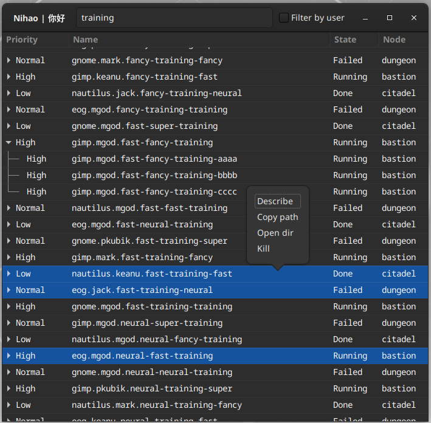

# GHao

This is my personal project developed to learn GObject and Gtk libraries. It is a graphical
interface to our internal Kubernetes management tools. Unfortunately, this application
can not be used out-of-the-box without those tools.

Since it is quite difficult to find any resources regarding GObject and Gtk on the internet,
I hope that this code might be useful for some of the learners. I think it should be
relatively easy to fork this project and change it into any kind of fancy list-displaying
utility. **Help yourself!**



## Usage (with fake data)

Make sure that you have the dependencies installed by following instructions on
[PyGObject documentation](https://pygobject.readthedocs.io/en/latest/getting_started.html)
and installing packages from `requirements.txt`:

```bash
pip3 install -r requirements.txt
```

Sorry, but PyGObject can not be installed the same way :(.

Then just invoke:

```bash
python3 -m ghao
```

An application window should show up with some fake records.
The rest should be intuitive or at least such is my intent.

## Real usage

By default the application uses fake Kubernetes object implemented in `ghao/fakectl.py`.
This means that it does not require a working K8s cluster and you are safe to experiment
with the GUI.

To use a real K8s instance make sure that `kubectl` utility is installed on your machine
and switch the `FAKE_KUBERNETES` constant somewhere in the code. This should work if your
system is set up accordingly to our internal guidelines :D.

Unfortunately, if it is not the case, you will need to reimplement the `KubeCtl` class
yourself. The original version is based on our internal library which makes too many
assumptions about our internal workflow. Most of the functions can be left unchanged
(e.g. `describe_cmd`, `kill_cmd`) others should be relatively easy to implement
(e.g. `get_jobs` - refer to the `FakeKubeCtl` class).
